# dht-crawler

[](https://crates.io/crates/dht-crawler)
[](https://docs.rs/dht-crawler)
[](https://github.com/yourusername/dht-crawler/blob/master/LICENSE)

一个基于 Rust 和 Tokio 实现的高性能分布式哈希表 (DHT) 爬虫库。它能够加入 BitTorrent DHT 网络，监听并自动获取种子的元数据（Metadata/InfoHash）。

## ✨ 核心特性

- **🚀 极致性能**：基于 `Tokio` 异步运行时构建，支持数万级的高并发连接处理。
- **📦 自动元数据抓取**：内置元数据获取引擎，自动完成从 InfoHash 到种子详情的抓取。
- **🌐 双栈网络支持**：完美支持 IPv4 和 IPv6（DualStack 模式），扩大节点覆盖范围。
- **⚡ 高度可配置**：支持自定义并发数、队列大小、超时时间等核心参数。
- **📊 监控友好**：提供 Prometheus 指标导出接口，轻松监控爬虫状态（可选）。

## 🏗️ 架构与流程

本库采用了 **Reactor 模式** 与 **Worker Pool** 相结合的高并发架构，确保了在处理海量 UDP 数据包时的吞吐量。

### 系统架构图



### 核心流程解析

1.  **UDP 读取与分发 (Reader & Dispatcher)**:
    *   独立的 UDP Reader 任务持续从 Socket 读取数据包。
    *   使用 Round-Robin 策略将数据包分发给 N 个（默认为 CPU 核心数）处理 Channel，实现无锁的负载均衡。

2.  **并行协议处理 (Packet Workers)**:
    *   N 个 Packet Worker 并行消费 Channel 中的数据。
    *   负责 Bencode 解码、KRPC 协议解析、消息路由（Query/Response）。
    *   高效处理 `get_peers` 和 `announce_peer` 消息，提取 InfoHash。

3.  **元数据调度 (Metadata Subsystem)**:
    *   提取出的 InfoHash 进入独立的 Hash Queue。
    *   Scheduler 根据配置的并发度（如 1000+）动态启动 Metadata Worker。
    *   Worker 通过 TCP 连接 Peer，使用 BEP-0009 协议下载种子元数据。

## 📦 安装

在你的 `Cargo.toml` 中添加依赖：

```toml
[dependencies]
dht-crawler = "0.1"
```

如果需要 **Prometheus 监控支持**：

```toml
[dependencies]
dht-crawler = { version = "0.1", features = ["metrics"] }
```

## 🚀 快速开始

下面是一个最简的启动示例。它会启动一个 DHT 节点，并在抓取到新种子时打印日志。

```rust
use dht_crawler::prelude::*;
use std::sync::Arc;

#[tokio::main]
async fn main() -> Result<()> {
    // 1. 配置爬虫参数
    let options = DHTOptions {
        port: 12313,
        auto_metadata: true, // 开启自动元数据获取
        ..Default::default()
    };

    // 2. 初始化 Server
    let server = DHTServer::new(options).await?;
    println!("DHT Server 启动于端口 12313...");

    // 3. 注册回调函数：当成功获取到种子元数据时触发
    server.on_torrent(move |torrent| {
        println!("🎉 抓取成功: {} (文件数: {})", torrent.name, torrent.files.len());
    });

    // 4. 启动服务
    server.start().await?;
    Ok(())
}
```

*完整的可运行代码请参考 [examples/main.rs](examples/main.rs)*

## ⚙️ 配置详解

`DHTOptions` 提供了丰富的配置项来调整爬虫行为：

```rust
let options = DHTOptions {
    // 监听端口
    port: 12313,
    
    // 网络模式：Ipv4Only, Ipv6Only, 或 DualStack (默认)
    netmode: NetMode::Ipv4Only,
    
    // 是否自动尝试从 peers 获取元数据
    auto_metadata: true,
    
    // 元数据获取超时时间 (秒)
    metadata_timeout: 5,
    
    // 元数据下载队列大小，建议根据内存大小调整
    max_metadata_queue_size: 100000,
    
    // 同时进行元数据下载的并发任务数
    max_metadata_worker_count: 1000,
    
    ..Default::default()
};
```

## 🛠️ 性能优化与编译选项

为了在生产环境中获得最佳性能，本库提供了几个可选的 Feature 和编译建议。

### 1. 启用 `mimalloc` (内存优化)

在长运行的高并发场景下，使用 `mimalloc` 替代默认内存分配器可以降低 10-30% 的内存占用。

**运行示例代码：**
```bash
cargo run --release --example dht_crawler_example --features mimalloc
```

**在项目中使用：**
只需在你的 `Cargo.toml` 和 `main.rs` 中配置全局分配器即可（无需依赖本库的 feature，直接引入 mimalloc crate）。

### 2. 启用 `metrics` (监控)

启用后，可以通过 HTTP 接口拉取 Prometheus 格式的监控数据。

**启动带监控的示例：**
```bash
cargo run --release --example dht_crawler_example --features metrics
```
*监控地址：http://localhost:9000/metrics*

### 3. 交叉编译 (Linux)

推荐使用以下命令编译 Linux 生产环境版本：

```bash
cargo build --release --target x86_64-unknown-linux-gnu --examples --features mimalloc,metrics
```

> **注意**：`mimalloc` feature 主要是为了方便示例程序 (`examples/`) 的编译。在将其作为库引用时，建议你在自己的 `bin` 项目中独立配置内存分配器。

## 📜 许可证

MIT License
