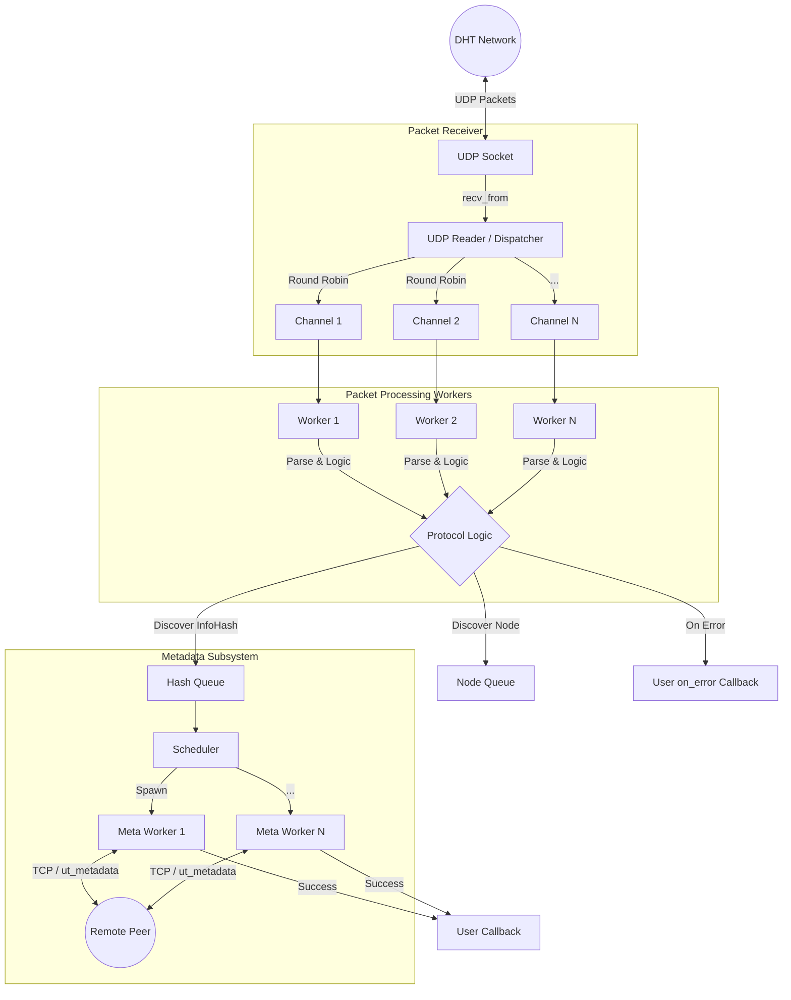

# dht-crawler

[](https://crates.io/crates/dht-crawler)
[](https://docs.rs/dht-crawler)
[](https://github.com/0xddy/dht-crawler/blob/master/LICENSE)

一个基于 Rust 和 Tokio 实现的高性能分布式哈希表 (DHT) 爬虫库。它能够加入 BitTorrent DHT 网络，监听并自动获取种子的元数据（Metadata/InfoHash）。

## ✨ 核心特性

- **🚀 极致性能**：基于 `Tokio` 异步运行时构建，支持数万级的高并发连接处理。
- **📦 自动元数据抓取**：内置元数据获取引擎，自动完成从 InfoHash 到种子详情的抓取。
- **🌐 双栈网络支持**：完美支持 IPv4 和 IPv6（DualStack 模式），扩大节点覆盖范围。
- **⚡ 高度可配置**：支持自定义并发数、队列大小、超时时间等核心参数。
- **📊 监控友好**：提供 Prometheus 指标导出接口，轻松监控爬虫状态（可选）。

## 🏗️ 架构与流程

本库采用了 **Reactor 模式** 与 **Worker Pool** 相结合的高并发架构，确保了在处理海量 UDP 数据包时的吞吐量。

### 系统架构图


```mermaid
graph TD
    %% 网络层
    Network((DHT Network)) <-->|UDP Packets| Socket[UDP Socket]

    %% 接收与分发
    subgraph Receiver [Packet Receiver]
        Socket -->|recv_from| Reader[UDP Reader / Dispatcher]
        Reader -->|Round Robin| Ch1[Channel 1]
        Reader -->|Round Robin| Ch2[Channel 2]
        Reader -->|...| ChN[Channel N]
    end

    %% 并行处理
    subgraph Processing [Packet Processing Workers]
        Ch1 --> W1[Worker 1]
        Ch2 --> W2[Worker 2]
        ChN --> WN[Worker N]
        
        W1 & W2 & WN -->|Parse & Logic| Logic{Protocol Logic}
    end

    %% 业务逻辑分支
    Logic -->|Discover Node| NodeMgr[Node Queue]
    Logic -->|Discover InfoHash| HashQ[Hash Queue]
    Logic -->|On Error| ErrorCb[User on_error Callback]

    %% 元数据抓取子系统
    subgraph Metadata [Metadata Subsystem]
        HashQ --> Scheduler[Scheduler]
        Scheduler -->|Spawn| MetaW1[Meta Worker 1]
        Scheduler -->|...| MetaWN[Meta Worker N]
        
        MetaW1 & MetaWN <-->|TCP / ut_metadata| Peer((Remote Peer))
    end
    
    MetaW1 & MetaWN -->|Success| Callback[User Callback]
```

### 核心流程解析

1.  **UDP 读取与分发 (Reader & Dispatcher)**:
    *   独立的 UDP Reader 任务持续从 Socket 读取数据包。
    *   使用 Round-Robin 策略将数据包分发给 N 个（默认为 CPU 核心数）处理 Channel，实现无锁的负载均衡。

2.  **并行协议处理 (Packet Workers)**:
    *   N 个 Packet Worker 并行消费 Channel 中的数据。
    *   负责 Bencode 解码、KRPC 协议解析、消息路由（Query/Response）。
    *   高效处理 `get_peers` 和 `announce_peer` 消息，提取 InfoHash。
    *   运行时错误通过 `on_error` 回调上报，不触发 panic，便于 JNI 等集成场景。

3.  **元数据调度 (Metadata Subsystem)**:
    *   提取出的 InfoHash 进入独立的 Hash Queue。
    *   Scheduler 根据配置的并发度（如 1000+）动态启动 Metadata Worker。
    *   Worker 通过 TCP 连接 Peer，使用 BEP-0009 协议下载种子元数据。

## 📦 安装

在你的 `Cargo.toml` 中添加依赖：

```toml
[dependencies]
dht-crawler = "0.1"
```

如果需要 **Prometheus 监控支持**：

```toml
[dependencies]
dht-crawler = { version = "0.1", features = ["metrics"] }
```

## 🚀 快速开始

下面是一个最简的启动示例。它会启动一个 DHT 节点，并在抓取到新种子时打印日志。

```rust
use dht_crawler::prelude::*;

#[tokio::main]
async fn main() -> Result<()> {
    // 1. 配置爬虫参数
    let options = DHTOptions {
        port: 12313,
        ..Default::default()
    };

    // 2. 初始化 Server
    let server = DHTServer::new(options).await?;
    println!("DHT Server 启动于端口 12313...");

    // 3. 注册错误回调：运行时错误通过回调输出，避免 panic（适合 JNI/嵌入式场景）
    server.on_error(|err| {
        eprintln!("DHT 错误: {}", err);
    });

    // 4. 注册回调：成功获取到种子元数据时触发
    server.on_torrent(move |torrent| {
        println!("🎉 抓取成功: {} (文件数: {})", torrent.name, torrent.files.len());
    });

    // 5. 可选：在拉取元数据前过滤 info_hash，返回 true 表示允许拉取
    server.on_metadata_fetch(|_hash| async move { true });

    // 6. 启动服务
    server.start().await?;
    Ok(())
}
```

*完整的可运行代码请参考 [examples/main.rs](examples/main.rs)*

## ⚙️ 配置详解

`DHTOptions` 提供了丰富的配置项来调整爬虫行为：

```rust
let options = DHTOptions {
    // 监听端口
    port: 12313,

    // 网络模式：Ipv4Only, Ipv6Only, 或 DualStack (默认)
    netmode: NetMode::Ipv4Only,

    // 元数据获取超时时间 (秒)
    metadata_timeout: 5,

    // 元数据下载队列大小，建议根据内存大小调整
    max_metadata_queue_size: 100000,

    // 同时进行元数据下载的并发任务数
    max_metadata_worker_count: 1000,

    // 节点池容量（DHT 节点队列）
    node_queue_capacity: 100000,

    // InfoHash 发现队列容量
    hash_queue_capacity: 10000,

    ..Default::default()
};
```

**可选 API**：`server.set_filter(|info_hash_hex| bool)` 可在发现阶段过滤要处理的 info_hash（返回 `true` 表示允许进入元数据队列）。

## 错误处理

库内采用严格的错误处理策略，避免底层异常导致进程崩溃，便于集成 JNI 或嵌入式场景。

### 错误类型 `DHTError`

```rust
use dht_crawler::{DHTError, Result};

// 错误变体包括：
// - DHTError::Network(io::Error)   — 网络/IO 错误
// - DHTError::Init(String)         — 初始化错误（如 socket、worker）
// - DHTError::Internal(String)     — 内部逻辑错误
// - DHTError::LockPoisoned(String) — 锁中毒（预留）
// - DHTError::Other(String)        — 其他
```

### 注册错误回调 `on_error`

运行时错误（如协议处理失败）会通过回调上报，而不会 panic：

```rust
let server = DHTServer::new(options).await?;

// 将错误输出到 stderr 或接入自己的日志/监控
server.on_error(|err| {
    log::error!("DHT 运行时错误: {}", err);
});

// JNI 场景示例：将错误传回 Java 层
// server.on_error(|err| {
//     jni_callback_on_error(env, err.to_string());
// });
```

### 同步错误：`Result` 传播

`DHTServer::new()` 和 `server.start()` 返回 `Result`，调用方需处理或传播：

```rust
#[tokio::main]
async fn main() -> Result<()> {
    let server = DHTServer::new(options).await?;  // 初始化失败会返回 Err
    server.on_error(|e| eprintln!("{}", e));
    server.start().await?;  // 启动失败（如 socket 绑定）会返回 Err
    Ok(())
}
```

## 编译示例

### 1. 启用 `mimalloc`（内存优化）

在长运行的高并发场景下，使用 `mimalloc` 可降低约 10–30% 内存占用。本库的 `mimalloc` feature 仅用于方便编译/运行示例；若将本库作为依赖使用，请在自己的 bin 项目中单独引入并配置 mimalloc 全局分配器。

```bash
cargo run --release --example dht_crawler_example --features mimalloc
```

### 2. 启用 `metrics`（监控）

启用后，可通过 HTTP 接口拉取 Prometheus 格式的监控数据。

```bash
cargo run --release --example dht_crawler_example --features metrics
```

监控地址：http://localhost:9000/metrics

## 📜 许可证

MIT License
